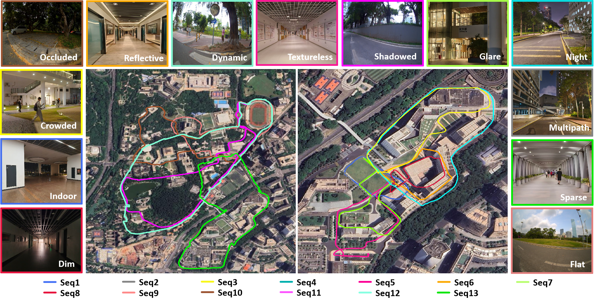
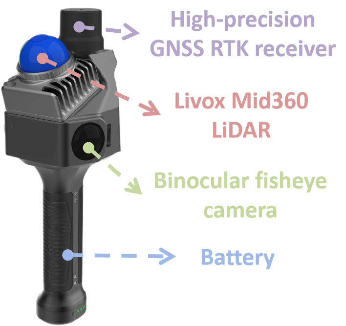

# SZU-Campus-GLVI Dataset

To evaluate the engineering practicality of SLAM algorithm in real complex environments and its robustness under extreme degradation conditions, we present the self-collected SZU-Campus-GLVI multi-sensor dataset.

<p align="center">
    
     <br><em>Trajectory examples from the SZU-Campus-GLVI dataset. Collected on the Shenzhen University campus and surrounding areas, all sensors underwent rigorous time synchronization and extrinsic parameter calibration. This dataset comprises 13 highly challenging sequences for LIVO and GNSS positioning systems, designed to validate the robustness of multi-sensor fusion SLAM systems under extreme scenarios.
    </em>
</p>

## Overview

This dataset accompanies the paper **"GLOBE-LIVO: A Global Robust Localization Method for Unmanned Systems Based on GNSS RTK-LiDAR-Inertial-Visual Fusion"**. The data acquisition platform integrates a Livox Mid-360 LiDAR, a global shutter camera, an ICM-40609 IMU, and a GNSS RTK receiver.

SZU-Campus-GLVI dataset specifically covers avariety of severely degraded scenarios that are highly challenging for LIVO(LiDAR-Inertial-Visual Odometry) or GNSS RTK systems:

1) **Dynamic Crowded Areas:** Data were collected at building entrances and exits, cafeterias, and plazas with dense populations, where a large number of moving pedestrians cause unstable visual features and severe dynamic interference in LiDAR point clouds;
2) **Long Indoor Corridors:** Traversing windowless indoor corridors lacking texture and geometric structure, resulting in simultaneous degradation of both vision and LiDAR;
3) **Urban Canyons and Canopy Occlusion:** Traveling along campus main roads and tree-lined paths, where tall buildings and dense tree canopies cause frequent GNSS RTK signal interruptions or multipath effects;
4) **Long-range Loop Closure Trajectories:** Some sequences have a total travel distance exceeding 3 km, with explicitly designed start-end coincident motion trajectories to examine the algorithm’s capability in suppressing accumulated drift and maintaining global consistency over long-duration operation.

## Download

The dataset is available at:

> [**Download Link**](https://example.com) *(to be updated)*

Each sequence is packaged as a ROS `.bag` file. See the [Data Structure](#data-structure) section for details.

## Data Structure

```
├── seq1/
│   └── data.bag
...
│
├── seq13/
│    └── data.bag
└── calibration.josn

```
Calibration.json contains the intrinsic parameters and distortion coefficients of the fisheye camera, the extrinsic parameters from the lidar to the camera, and the extrinsic parameters from the lidar to the IMU.

## Sensor Setup

<p align="center">
    
    <br><em>The multi-modal perception system used for collecting the SZU-Campus-GLVI dataset, capable of simultaneously acquiring high-precision GNSS RTK, camera, LiDAR, and IMU data.
    </em>
</p>

| Sensor          | Parameter Category       | Specification                     |
|-----------------|--------------------------|-----------------------------------|
| IMU             | Gyroscope Rate           | 200 Hz                            |
|                 | Accelerometer Bias       | 50 µg                             |
|                 | Accelerometer Noise Density     | 70 µg/√Hz                         |
|                 | Gyroscope Bias Stability | 0.05 °/√Hz                        |
|                 | Gyroscope Noise Density  | 0.004 °/s/√Hz                     |
| Camera          | Sampling Rate            | 10 Hz                             |
|                 | Resolution               | 760 × 1008 pixels                 |
| LiDAR           | Sampling Rate            | 10 Hz                             |
|                 | Point Cloud Rate         | 200,000 pts/s                     |
|                 | Range                    | 100 m                             |
|                 | Measurement Error        | < 0.02 m                          |
|                 | Field of View            | Horizontal 360°, Vertical 45°     |
| GNSS RTK Receiver | RTK Positioning Accuracy | Horizontal: 0.8 cm + 1 ppm<br>Vertical: 1.5 cm + 1 ppm |

## License

Dataset: [CC BY 4.0](https://creativecommons.org/licenses/by/4.0/) — free to share and adapt with attribution.

## Citation

title   = {GLOBE-LIVO: A Global Robust Localization Method for Unmanned Systems Based on GNSS RTK-LiDAR-Inertial-Visual Fusion}

Under review...
             
## Contact

- **Jiangbo Song** — [songjb@szu.edu.cn](mailto:songjb@szu.edu.cn)

Shenzhen University, College of Civil and Transportation Engineering